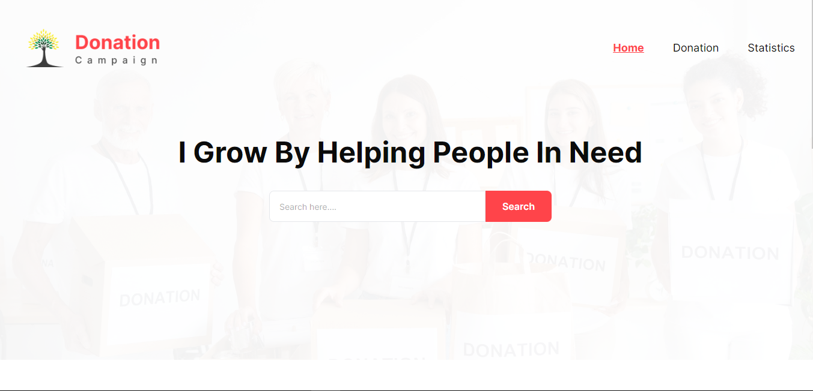

<h1 align="center">Donation Campaign</h1>

## 📝 Features

1. **Category Selection**: Users can select specific categories (e.g., Health, Education, Clothing, Food) for their donations.

2. **Search Functionality**: Allow users to search for specific donations by category.

3. **Permanent Storage:**: Donations made by users are stored permanently in local storage.

4. **Statistics**: In statistics page users can view graphical representations of their donation statistics through a pie chart.

5. **User-Friendly Toasts**: Whenever there is any error occur the application communicate with a friendly toast message. It enhance the user experience.

6. **Responsive Layout**: Entire application is responsive. It fit's all the devices according to the screen size of the user.
